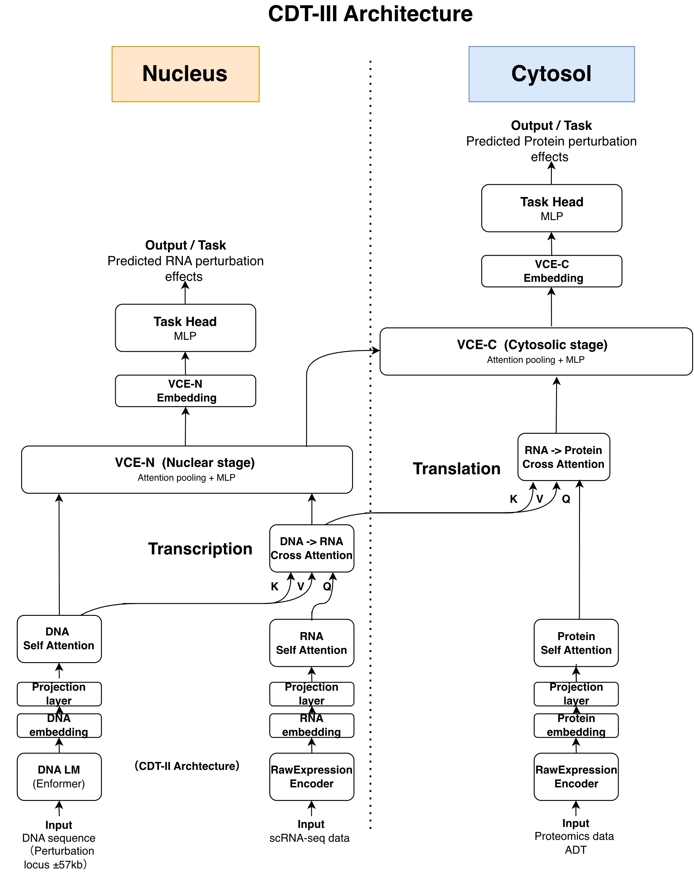

# Central Dogma Transformer III: Interpretable AI Across DNA, RNA, and Protein

**CDT-III** extends mechanism-oriented AI across the full central dogma: DNA, RNA, and protein. Its two-stage architecture mirrors the spatial compartmentalization of the cell: VCE-N models transcription in the nucleus and VCE-C models translation in the cytosol.

📄 **Paper**: [arXiv (coming soon)]()
🧬 **CDT-II**: [arXiv:2602.08751](https://arxiv.org/abs/2602.08751) | [GitHub](https://github.com/nobusama/CDT2)
📊 **Data**: [HuggingFace](https://huggingface.co/datasets/nobusama17/CDT2-data)

## Key Results

| Metric | Value |
|--------|-------|
| RNA per-gene *r* (5 held-out genes) | 0.843 |
| Protein per-gene *r* (65 expressed) | 0.969 |
| RNA improvement over CDT-II | +4.9% (0.804 → 0.843) |
| CTCF enrichment improvement | +30% (6.6× → 8.59×) |
| CD52/Alemtuzumab direction agreement | 29/29 (100%) |
| Known side effects recapitulated | 5/7 |
| Gradient NTC validation | *r* = 0.939 |

## Architecture



CDT-III comprises two stages:
- **VCE-N (Nuclear)**: Identical to CDT-II. DNA self-attention, RNA self-attention, DNA→RNA cross-attention, and VCE pooling. Models transcription.
- **VCE-C (Cytosolic)**: New in CDT-III. Protein self-attention, RNA→Protein cross-attention, and VCE pooling. Models translation.

Each stage preserves dimensional compatibility (d×2 → d), enabling 100% transfer of CDT-II pre-trained weights.

## In Silico Pharmacology

CDT-III enables drug side effect screening without clinical data:

1. **Direct Prediction**: For targets with CRISPRi data — simultaneously predicts RNA and protein changes
2. **Gradient Analysis**: For novel targets — requires only unperturbed baseline data (NTC mean + DNA embedding), validated at *r* = 0.939 vs. perturbation-based analysis

Any of the 2,361 modeled genes can be screened for potential side effects without new perturbation experiments.

## Repository Structure

```
CDT3/
├── docs/                    # Paper (NeurIPS 2026 format)
│   ├── cdt_iii_neurips.tex
│   ├── cdt_iii_neurips.pdf
│   └── neurips_2024.sty
├── figures/
│   ├── main/               # Architecture figures
│   └── neurips/            # Result figures
├── notebooks/
│   ├── training/           # Model training notebooks
│   │   ├── CDT_Morris_Trimodal_DataPrep.ipynb
│   │   └── CDT_Morris_2StageVCE_v2_Training.ipynb
│   └── analysis/           # Analysis notebooks
│       ├── CDT_Morris_2StageVCE_Evaluation.ipynb
│       ├── CDT_Morris_2StageVCE_CD52_Alemtuzumab.ipynb
│       ├── CDT_Morris_2StageVCE_Gradient_TRS.ipynb
│       ├── CDT_Morris_2StageVCE_CTCF_HiC.ipynb
│       └── CDT_Morris_2StageVCE_Attention.ipynb
└── LICENSE
```

## Data

CDT-III uses the STING-seq v2 dataset ([Morris et al., 2023](https://doi.org/10.1126/science.adh7699); GEO: [GSE171452](https://www.ncbi.nlm.nih.gov/geo/query/acc.cgi?acc=GSE171452)), which jointly profiles scRNA-seq and 193 surface proteins (CITE-seq) in K562 cells.

Pre-computed embeddings and training data are available at [HuggingFace](https://huggingface.co/datasets/nobusama17/CDT2-data).

## Citation

```bibtex
@article{ota2026cdtiii,
  title={Central Dogma Transformer III: Interpretable AI Across DNA, RNA, and Protein},
  author={Ota, Nobuyuki},
  year={2026},
  note={Preprint}
}
```

## License

MIT License. See [LICENSE](LICENSE) for details.

## Author

Nobuyuki Ota — Independent Researcher, Burlingame, CA, USA
